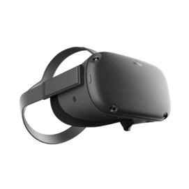
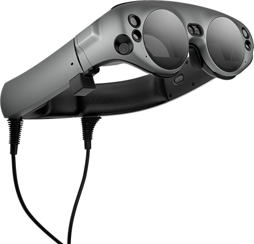
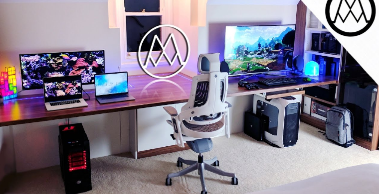
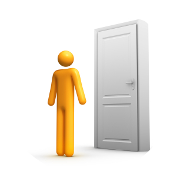
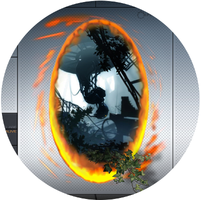

<!-- .slide: data-background-video="media/video/virtualreality.mp4" data-background-video-loop="true" data-background-video-muted="true" data-state="state--bg-dark" -->

IV Semana Acadêmica da PUCPR - 2019

  <h1>Realidade Virtual na Web</h1>
  
  

    <a href="https://twitter.com/tiagovignatti">@tiagovignatti</a> | <a href="https://www.imersys.com">Imersys</a>
     
    <a style="font-size: 18px; text-align: left" href="https://github.com/tiagovignatti/dg-presentation">https://github.com/tiagovignatti/dg-presentation
    

  

------

<!-- .slide: data-background-color="#000000" -->

# Realidade Virtual e "as outras"

---

## XR, VR, AR, MR, etc

---

  

  

  

  

  

  

---

## XR = VR, AR, MR, etc

---

<!-- .slide: data-background="media/img/imersys-content-2019.gif" -->

## Imersys: estúdio de inovação

------
<!-- .slide: data-background-color="#000000" -->

# ... fricção das tecnologias inovadoras

---

## RV: dificuldade em disponibilizar para usuários "normais"

  

    
    <i>Custo dos dispositivos</i>
  

  

    
    <i>Compudatores gamers</i>
  

  

    
    <i>Importação no Brasil</i>
  

---

## RV: dificuldade em disponibilizar para usuários "normais"

  

    
    <i>Falta de Apps</i>
  

  

    
    <i>Unity & UE4: compilação nativa, mono-plataforma</i>
  

  

    
    <i>App Store proprietára</i>
  

---

# Web

  

    
    <i>Plataforma aberta</i>
  

  

    
    <i>Multi-dispostivo e multi-plataforma</i>
  

  

    
    <i>Simplifica o processo de download / upload</i>
  

------

<!-- .slide: data-background-color="#000000" -->

# VR na Web

---

<!-- .slide: data-background="media/img/a-blast.gif" -->

---

<!-- .slide: data-background="media/img/apainter.gif" -->

---

<!-- .slide: data-background="media/img/citybuilder.gif" -->

---

<!-- .slide: data-background="media/img/math.gif" -->

---

<!-- .slide: data-background="media/img/ar.gif" -->

------

<!-- .slide: data-background="media/img/metaverse.jpg" -->

# Os desafios de RV na Web

---

<h3 style="text-align: left">Os desafios de trazer a RV para a plataforma Web</h3>
&nbsp;

  
 • WebGL

  
 • WebXR API

  
 • Gamepad API

---

<h3 style="text-align: left">WebGL</h3>
&nbsp;

  
 • Nós já temos uma 3D scene no browser com WebGL rodando na GPU

---

<h3 style="text-align: left">WebXR API</h3>
&nbsp;

  
 • Para trackear espaços, pose e interação com VR e AR

  
 • Foi desenvolvido inicialmente a WebVR API, há 5 anos

  
 • Renasceu em final de 2017 como WebXR

  
 • W3C tem um working group para o WebXR e ela está na fase final de "Candidate Recommendation" (Dez 2019)

---

<h3 style="text-align: left">Gamepad API</h3>
&nbsp;

  
 • Para o mapeamento correto dos controles e dispositivos de entrada

------

<!-- .slide: data-background-color="#000000" -->

# Como aprender mais sobre VR na Web?

---

<h3 style="text-align: left">Como aprender mais sobre VR na Web?
</h3>
&nbsp;

  
 • Colaborando: Discord, Slack (A-Frame, WebVR) e Mozilla Hubs events (dentro e fora de VR!)

  
 • Estudando: Computer Vision para algoritmos de entendimento de espaço, SLAM

  
 • Estudando: padrões de design e UI

---

<h3 style="text-align: left">Como aprender mais sobre VR na Web?
</h3>
&nbsp;

  
 • Testando: WebXR no <b>about:flags</b> do browser e polyfill

  
 • Praticando: Fazer o remix de um exemplo no Glitch

  
 • Desenvolvendo, através das frameworks: A-Frame, ThreeJS, Babylon.js, React 360

------

<!-- .slide: data-background-color="#000000" -->

<h2 style="text-align: left">Resumindo...</h2>
&nbsp;

&nbsp;

  
VR na Web está se tornando confiável, estável e potencializa uma mais rápida adoção da tecnologia

---

<!-- .slide: data-background="media/img/ambia-bg.png" -->

<h2 style="text-align: left">Obrigado!</h2>
&nbsp;

&nbsp;

  
<a href="https://twitter.com/tiagovignatti">@tiagovignatti</a> | <a href="https://www.imersys.com">Imersys</a>

  &nbsp;
  
PS: we're hiring!

  
https://www.imersys.com/post/imersys-oportunidades-para-programacao-curitiba

